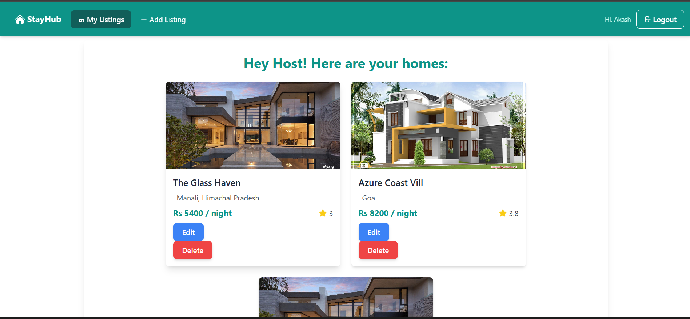
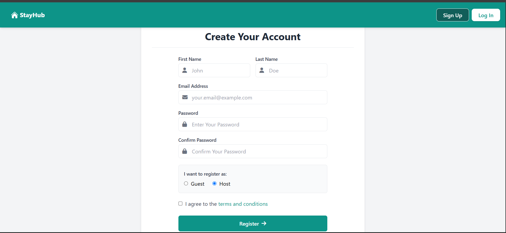
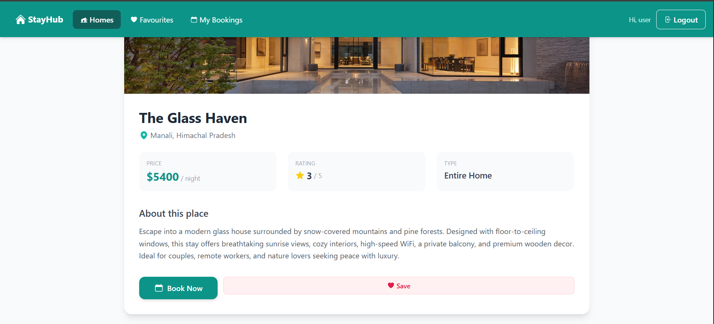
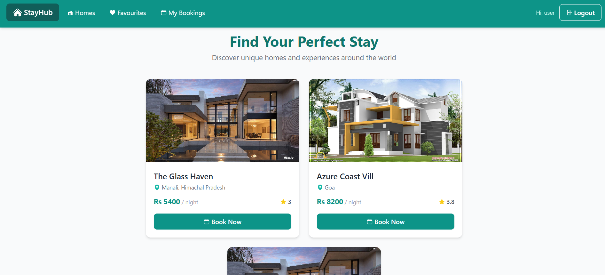
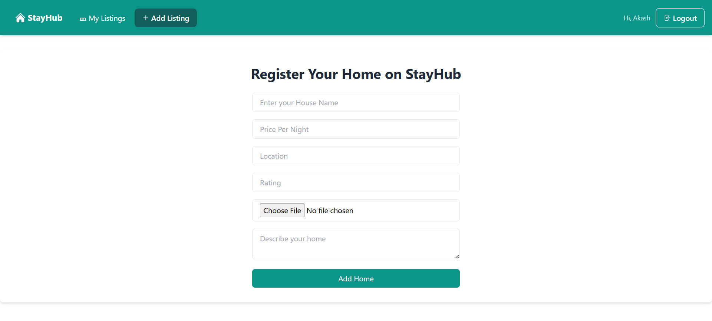

# 🏡 StayHub — Premium Property Booking Platform

StayHub is a modern full-stack accommodation and property booking platform crafted to deliver a seamless digital booking experience.

The platform enables users to explore premium stays, discover curated properties, save favourites, and reserve accommodations through an elegant and responsive interface.

Built with scalable backend architecture using Node.js, Express.js, MongoDB, and EJS, StayHub focuses on performance, maintainability, and clean user experiences.

From dynamic listings and role-based access control to booking workflows and image-driven property management, the application simulates real-world accommodation platforms with a production-style architecture.

---

### 🎯 What StayHub Solves

* Simplifies property discovery
* Improves booking experience
* Supports host property management
* Enables personalized user interactions
* Delivers responsive multi-device access

---

# 🌐 Live Preview

## Live Demo
https://stayhub-22ln.onrender.com
---
# ✨ Features

* ✅ Authentication & Secure Sessions
* ✅ Guest & Host Role Management
* ✅ Dynamic Property Listings
* ✅ Property Detail Pages
* ✅ Booking Management System
* ✅ Favourite Homes Functionality
* ✅ Property Image Upload
* ✅ Responsive UI Experience
* ✅ Server Side Rendering
* ✅ Session-Based Authentication
* ✅ Clean Navigation & Layout
* ✅ Modern Booking Workflow

---

# 🛠️ Tech Stack

| Layer            | Technology        |
| ---------------- | ----------------- |
| Frontend         | EJS               |
| Styling          | Tailwind CSS      |
| Backend          | Node.js           |
| Server Framework | Express.js        |
| Database         | MongoDB           |
| ODM              | Mongoose          |
| Authentication   | Express Session   |
| Security         | bcryptjs          |
| File Upload      | Multer            |
| Architecture     | MVC Pattern       |
| Validation       | Express Validator |
| Runtime          | Node.js           |
| Package Manager  | npm               |
| Version Control  | Git + GitHub      |

---

# 🏗 System Architecture

```text
User
 ↓
Frontend (EJS + Tailwind)
 ↓
Express Routes
 ↓
Controllers
 ↓
MongoDB Database
 ↓
Bookings / Favourites
```

---

# ⚙️ Backend Engineering Highlights

### 🔐 Authentication System

### Backend

Built with a modular server-side architecture focused on scalability, maintainability, and clean separation of concerns.

* Node.js Runtime Environment
* Express.js Server Framework
* MVC Architecture (Model–View–Controller)
* RESTful Route Organization
* Session-Based Authentication
* Secure Password Hashing using bcrypt
* MongoDB Integration using Mongoose
* Property CRUD Operations
* Booking Management System
* Favourite Homes Management
* Role-Based Access Control (Guest / Host)
* Image Upload Handling using Multer
* Middleware Driven Request Processing
* Dynamic Server-Side Rendering using EJS
* Validation & Error Handling
* Protected Routes for Authenticated Users
* Modular Controller Architecture
* Persistent User Sessions
* File Storage & Upload Management
* Custom Routing Layer
* Form Handling & Data Processing

#### Backend Modules

Authentication Layer

* User Signup
* User Login
* Session Persistence
* Route Protection

Property Management

* Add Property
* Edit Property
* Delete Property
* View Listings

Booking Engine

* Create Booking
* Cancel Booking
* Booking Tracking

User Features

* Save Favourites
* Manage Reservations
* Personalized Dashboard

Database Layer

* User Schema
* Property Schema
* Relationships using Mongoose References

---

### 🏠 Property Management

* Add Property
* Edit Property
* Delete Property
* Upload Property Images
* Dynamic Listings

---

### 📅 Booking Engine

* Reserve Property
* Cancel Booking
* Booking Tracking
* Reservation Management

---

### ❤️ Favourite System

* Save Properties
* Remove Saved Homes
* Personalized Experience

---

### 👥 Role-Based Access

Guest:

* Explore Homes
* Save Properties
* Make Bookings

Host:

* Manage Listings
* Upload Properties
* Edit Property Details

---

# 📸 Application Preview

## 🏠 Homepage



---

## 🔐 Login Page



---

## 🏡 Property Details



---

## 📅 Booking Experience



---

## ➕ Add Property (Host)




---

# 📂 Project Structure

```text
StayHub/
│
├── controllers/
│   ├── authController.js
│   ├── hostController.js
│   ├── storeController.js
│
├── models/
│   ├── user.js
│   └── home.js
│
├── routes/
│
├── views/
│
├── public/
│
├── uploads/
│
├── utils/
│
├── app.js
├── package.json
└── README.md
```

---

# 🚀 Installation & Setup

Clone repository

```bash
git clone https://github.com/akashsingh77-ux/stayhub.git
```

Move into folder

```bash
cd stayhub
```

Install dependencies

```bash
npm install
```

Run project

```bash
npm start
```

Open browser

```text
http://localhost:3000
```

---

# 📈 Future Improvements

* 💳 Payment Gateway Integration
* ⭐ Review & Rating System
* 📍 Maps & Location Integration
* 📩 Email Notifications
* 🤖 AI Property Recommendations
* 📊 Host Analytics Dashboard
* 🔔 Real-Time Booking Updates
* 🌍 Multi-City Search
* 📱 Progressive Web App Support
* 🧾 Booking History & Reports

---

# 👨‍💻 Author

**Akash Singh**

GitHub:
https://github.com/akashsingh77-ux

---

### ⭐ If you liked this project, consider giving it a star.
